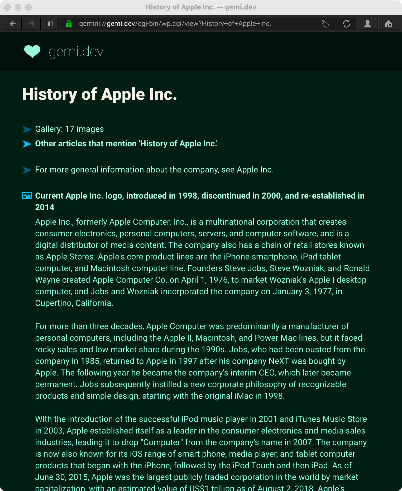
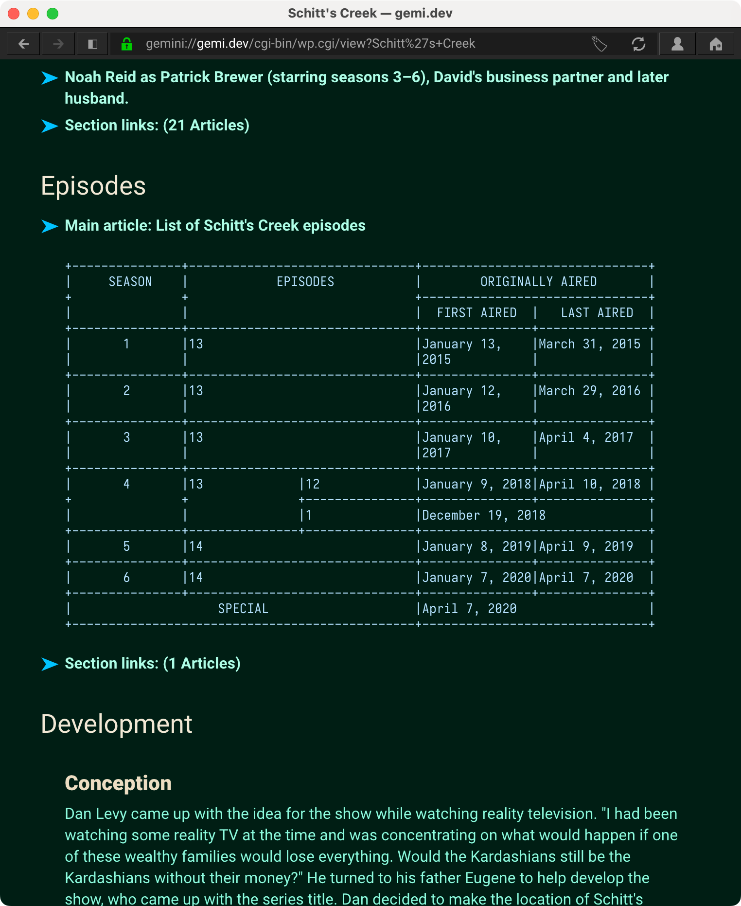
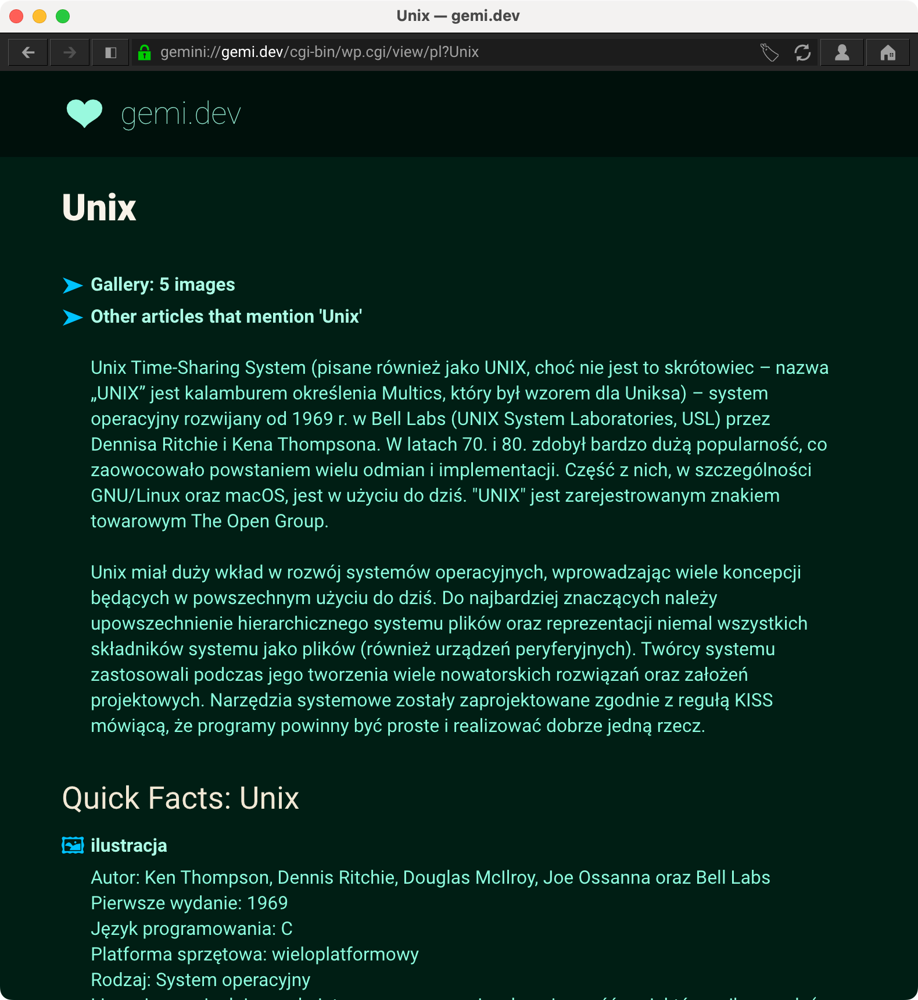

# Gemipedia
Gemipedia  is a [Gemini](https://en.wikipedia.org/wiki/Gemini_(protocol)) frontend to Wikipedia, focused on providing a delightful class reading experience. Gemipedia supports accessing all language-specific Wikipedias.

*Rendering main article with navigation suggestions*

*Handling sections, references, and tables*

*Accessing Polish Wikipedia*

## Demo 
Visit `gemini://gemini://gemi.dev/cgi-bin/wp.cgi/` with a [Gemini client](https://github.com/kr1sp1n/awesome-gemini) or [via an HTTP-to-Gemini proxy](https://portal.mozz.us/gemini/gemi.dev/cgi-bin/wp.cgi/)

## Features

### Content Discovery
* Access all language-specific versions of Wikipedia
* Search results with article descriptions, excerpts, and feature image links to find correct content more quickly
* Supports fuzzy matching for finding articles via "Go to article"
* Featured Content, updated daily, which displaying the article of the day and the 25 most popular stories on Wikipedia from the previous day (same as the front page of Wikipedia)
* "Other Articles" feature. Finds other articles that reference the current article
* "Articles near this article" feature. Finds other articles that are geographic close to the current article
* Supports disambiguation and "see other" navigation links 

### Usability

* Groups all the links to additional articles by section, and separate "References" pages for each section
* Gallery View, which pulls all media like images and video out into a separate view
* Images/Media is displayed with intelligently created captions
* Geographic view! Extracts geographic coordinates and provides links to OpenStreetMaps and native Map apps
* Removes superfluous content for Gemini like references, citations, bibliographies, and links to external websites
* Links to source article on Wikipedia over HTTPS
* Caches calls to Wikipedia to speed up viewing sub sections or page refreshing

### Rendering 
* Supports tables, including cells that span multiple rows or columns, by converting them to ASCII art tables inside of preformatted sections
* Selects high resolution images while still using appropriate size for Gemini/smolweb ethos
* Supports math formulas by displaying them as link lines to PNG images
* Support chemical and physics formulas by converting subscripts and superscript tags into Unicode Subscript/Superscript characters!
* Supports image maps
* Supports Infoxbox rendering
* Supports timeline images and tables
* Supports image galleries
* Add White background to transparent images for better reading on clients with dark mode

### Offline Support
* Images are proxied from Wikipedia and rendered with appropriate file extension and MIME type for better offline rendering
* PDF export for offline reading